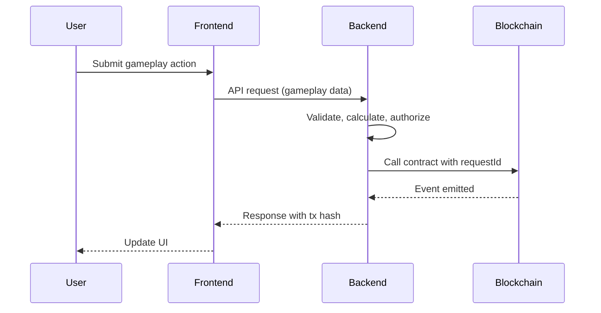

                                                          # Backend Interaction Flow

## Overview

The backend is the sole entity authorized to modify player state on-chain. It acts as the game engine, while the blockchain serves as an immutable settlement layer.

## Flow Diagram

## Detailed Flows

### Granting XP

1. User completes a mission or wins a prediction.
2. Frontend sends gameplay result to backend API.
3. Backend validates the result against off-chain game logic.
4. Backend generates a unique `requestId` (UUID v4 → bytes32).
5. Backend calls `PointsManager.grantXP(player, amount, requestId)`.
6. Contract verifies `BACKEND_ROLE`, checks `requestId` uniqueness, and updates state.
7. `XPGranted` and `LevelUp` (if applicable) events are emitted.
8. Backend returns tx hash and updated profile to frontend.

### Recording Activity

1. User performs a daily action (login, play, share).
2. Frontend submits activity to backend.
3. Backend verifies eligibility and generates `requestId`.
4. Backend calls `ActivityRegistry.recordActivity(player, requestId)`.
5. Contract calculates streak and updates aggregate stats.
6. `ActivityRecorded` and `StreakUpdated` events are emitted.

### Executing a Payout

1. Backend determines user is eligible for a reward.
2. Backend checks treasury balance via `treasuryBalance()` or `assetBalance()`.
3. Backend calls `RewardTreasury.payout(recipient, asset, amount, requestId)`.
4. Contract verifies `REWARD_MANAGER_ROLE`, checks `requestId`, validates balance.
5. Tokens are transferred to recipient.
6. `RewardPaid` event is emitted with timestamp and request ID.

## Backend Requirements

- Must sign transactions with the `BACKEND_ROLE` private key.
- Must generate cryptographically unique `requestId` values.
- Must index contract events for frontend display.
- Must handle contract errors gracefully and provide user-friendly messages.
- Must not expose private keys to the frontend.

## Frontend Requirements

- Frontend never holds backend signer keys.
- Frontend only submits gameplay data to backend APIs.
- Frontend listens to blockchain events for real-time updates.
- Frontend displays transaction confirmations and errors from backend responses.
