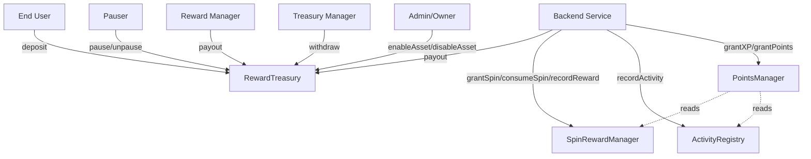

# Contract Interaction Diagram

## Interaction Notes

- Backend is the only entity that can modify player state (XP, points, spins, activity).
- Admin manages asset registry and treasury roles.
- Treasury Manager handles fund withdrawals.
- Reward Manager executes payouts.
- Pauser can pause/unpause all state-changing operations.
- PointsManager reads from ActivityRegistry and SpinRewardManager for profile completeness.
