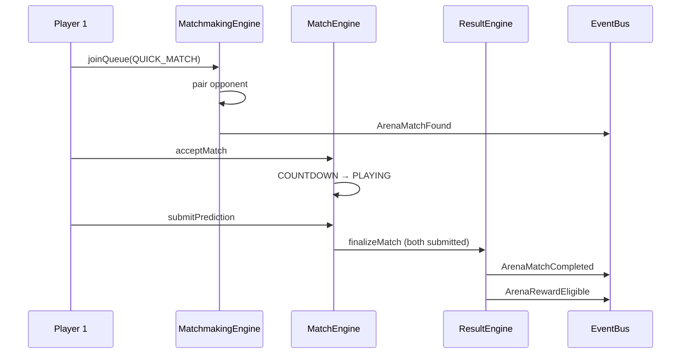

# NEXORA Arena Architecture

## Overview

NEXORA Arena is the competitive head-to-head layer of the platform. It replaces the legacy "Vibe Duel" concept with a modular arena system that supports prediction duels today and additional game modes via `GameEngine` adapters in the future.

Arena is **not** gambling — it is a skill-based challenge platform. Rewards flow through the existing `RewardEngine` → `SettlementEngine` → `RewardLedger` pipeline via domain events, never through direct blockchain calls from arena engines.

## Engines

| Engine | Responsibility |
|--------|----------------|
| `ArenaEngine` | Home dashboard, rating, history, replay, arena presence |
| `MatchmakingEngine` | Quick match, friend challenge, private/invite/rematch queues |
| `MatchEngine` | Match lifecycle: accept, decline, predictions, state transitions |
| `ResultEngine` | Winner/loser/draw, rating updates, replay, settlement events |
| `SpectatorEngine` | Read-only live match viewing (future live streaming ready) |

## Rating Framework

Rating uses a pluggable `IRatingStrategy` interface. The default implementation is `SimpleRatingStrategy` (Elo-like). Swap strategies without changing arena engines:

```typescript
interface IRatingStrategy {
  name: string;
  updateRating(input: RatingUpdateInput): RatingSnapshot;
}
```

Tracked per season: skill rating, deviation, win rate, matches played, streaks, league tier.

## Database Models

- `Arena`, `ArenaMatch`, `ArenaQueue`, `ArenaInvitation`
- `MatchParticipant`, `ArenaResult`, `ArenaReplay`
- `ArenaRating`, `ArenaSeasonStatistic`, `ArenaPresence`

### Match Lifecycle

`WAITING → ACCEPTED → COUNTDOWN → PLAYING → FINISHED → SETTLING → COMPLETED → ARCHIVED`

### Queue States

`SEARCHING → MATCHED → ACCEPTED → DECLINED → EXPIRED → CANCELLED`

## APIs

| Route | Methods | Purpose |
|-------|---------|---------|
| `/api/arena` | GET | Arena home + queue + live matches |
| `/api/arena/queue` | GET, POST | Join / status |
| `/api/arena/accept` | POST | Accept match |
| `/api/arena/cancel` | POST | Cancel queue / decline |
| `/api/arena/match` | GET, POST | Match state / submit prediction |
| `/api/arena/history` | GET | Match history |
| `/api/arena/replay` | GET | Replay metadata + timeline |
| `/api/arena/rating` | GET | Current rating |
| `/api/arena/invite` | POST | Friend challenge / join code / rematch |

## Event Integration

| Event | Side Effects |
|-------|--------------|
| `ArenaQueueJoined` | Arena presence → SEARCHING |
| `ArenaMatchFound` | Notifications, presence → MATCHED |
| `ArenaMatchStarted` | Presence → PLAYING |
| `ArenaMatchCompleted` | Animations, feed, stats, XP/points, friend fan-out |
| `ArenaRewardEligible` | Profile XP/points increment |
| `ArenaInvitationSent` | Challenge notification |

## Replay Model

Replays store metadata only (no video):

- `timeline` — ordered event log
- `statistics` — scores, target value
- `result` — winner, draw flag
- `auditHash` — tamper-evident result hash

## Sequence: Quick Match



## Prompt 10 Improvements (bundled)

1. **Presence Sessions** — `PresenceSession` per device; aggregated `Presence` status
2. **Feed Ranking** — `priority`, `pinned`, `rankScore` on feed items
3. **Referral Fraud** — `ReferralFraudEngine` with device/IP/velocity heuristics
4. **Short Invite Codes** — 6-char `shortCode` on `InviteCode`
5. **Community Highlights** — featured post types prioritized in feed
6. **Animation Registry** — centralized `lib/animations/registry.ts`

## Security

- Queue spam prevented via active queue check
- Duplicate matches blocked by participant uniqueness
- Results audited via SHA-256 hash before settlement
- Replay attacks mitigated via request IDs and settled flag
- Referral rewards blocked when `fraudStatus` is FLAGGED/REVIEW/REJECTED

## Performance Recommendations

- Index queue by `(status, matchType, rating)` for O(log n) pairing
- Poll queue/match endpoints at 2–3s during active states only
- Archive completed matches older than 90 days to cold storage
- Cache rating/league on home endpoint (15s stale time)
- Move matchmaking pairing to a background worker at scale

## Recommendations Before Prompt 12

- Season rollover job for `ArenaSeasonStatistic` and rating reset options
- Live spectator WebSocket channel built on `SpectatorEngine.watchMatch`
- Admin moderation dashboard for flagged referrals
- Arena-specific achievements and mission rules
- Cross-region queue sharding for latency-sensitive duels
- Content management hooks for featured tournaments and weekly spotlights
