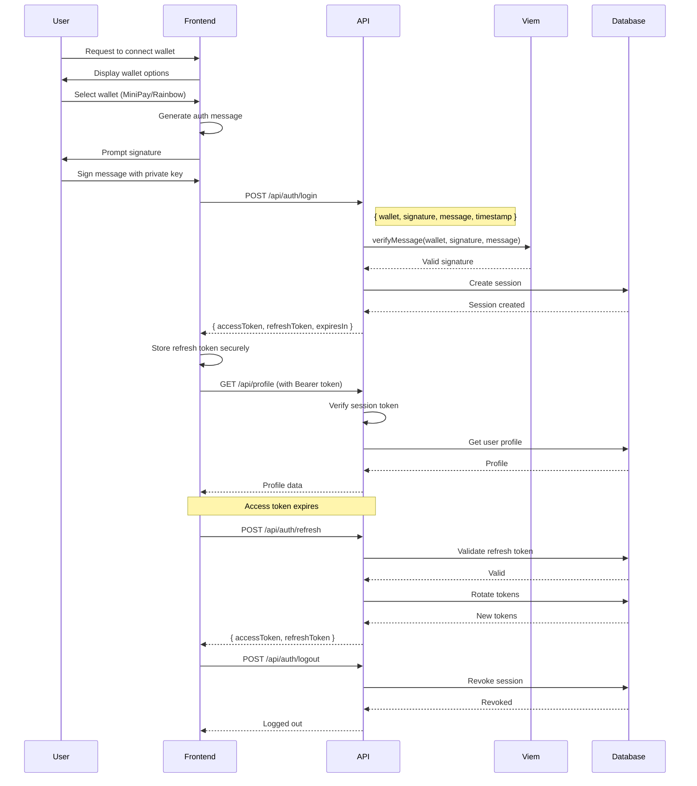

# Authentication Flow

## Rules

- Authorization header: `Bearer <accessToken>`
- Access token TTL: 15 minutes
- Refresh token TTL: 30 days
- Refresh token rotation on every use
- Session revoked on logout
- Wallet headers are no longer trusted
