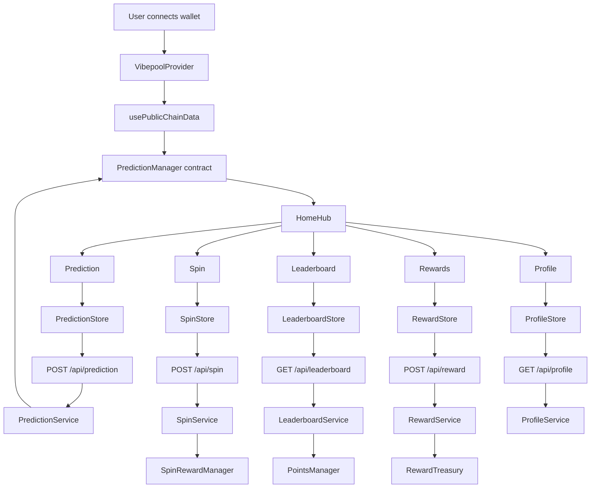

# Feature Interaction Diagram

Interactions:
- Home aggregates public chain data and links to features.
- Features update their own Zustand stores.
- Stores may call API routes.
- API routes call services.
- Services call contracts or database.
