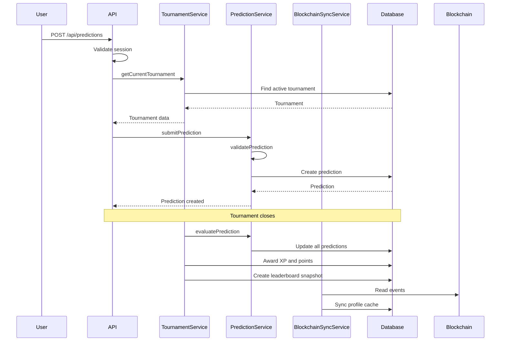

# Prediction Evaluation Flow

## Evaluation Steps

1. Tournament transitions to EVALUATING
2. All PENDING predictions are loaded
3. Actual value is applied
4. Accuracy is calculated for each prediction
5. Rankings are determined by accuracy, time, streak, random seed
6. XP and points are awarded based on settings
7. Leaderboard snapshot is created
8. Tournament transitions to COMPLETED
9. Reward eligibility is calculated
