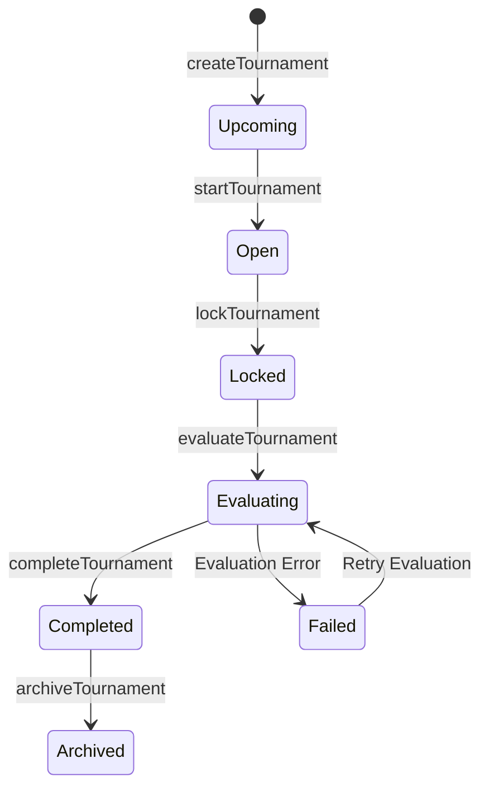

# Tournament Lifecycle

## State Descriptions

- **Upcoming**: Tournament created but not yet open for predictions
- **Open**: Accepting predictions from users
- **Locked**: Prediction window closed, awaiting evaluation
- **Evaluating**: Results being calculated, leaderboard generated
- **Completed**: Rewards distributed, tournament finalized
- **Archived**: Historical record, not active
